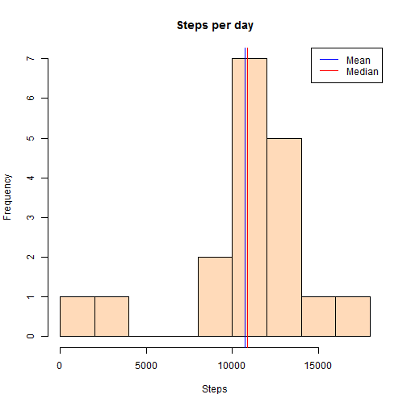
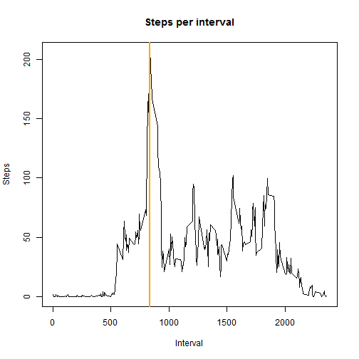
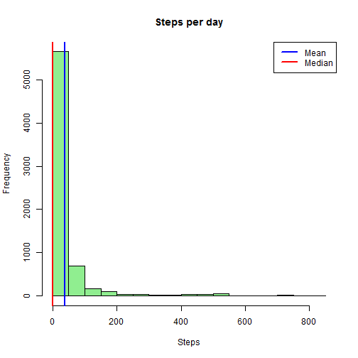
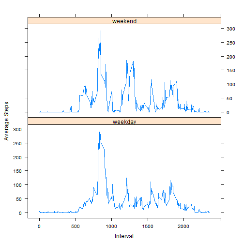

# Reproducible Research Peer Assessment 1

## Loading and preprocessing the data


```r
options(scipen = 4, digits = 2)

setwd("C:/Users/JWilkinson/represearch/RepData_PeerAssessment1")
df <- read.csv(unz("activity.zip", "activity.csv"))
df$date<- as.Date(df$date, format = "%Y-%d-%m")
```

## What is mean total number of steps taken per day?


```r
df2 <- aggregate(steps ~ date, data = df, sum, na.rm = TRUE)
hist(df2$steps, xlab = "Steps", main = "Steps per day", col = "peachpuff", breaks = 9)
smean <- mean(df2$steps)
smedian<- median(df2$steps)
abline(v = smean, col = "blue")
abline(v = smedian, col = "red")
legend(x = "topright",c("Mean", "Median"), col = c("blue", "red"), lwd = c(1,1))
```

 


As can be seen in the histogram above the mean steps per day is 10729.94, and the median is 10890.

## What is the average daily activity pattern?


```r
agdf <- aggregate(df, by = list(df$interval), FUN = mean, na.rm = TRUE)
plot(agdf$steps~agdf$interval, type = "l", main = "Steps per interval", xlab = "Interval", ylab = "Steps")
wm <- which.max(agdf[,2])
maxint <- agdf[wm,"interval"]
maxstep <- agdf[wm,"steps"]
abline(v = maxint, col = "orange", lwd = 2)
```

 


As noted in the graph above, interval 835 has the highest average steps at 206.17.

## Imputing missing values


```r
keep <- !is.na(df$date)
df3 <- df[keep,]
missingsteps <- nrow(df3) - nrow(df2)
totmissing <- nrow(df) - nrow(df2)

#due to the uniform nature of the spread of NA values a simple arithmetic mean by interval for NAs replacement was used.

library(data.table)
```

```
## Warning: package 'data.table' was built under R version 3.0.3
```

```r
filldf <- data.table(agdf, key = "interval")
nadf <- data.table(df3, key = "interval")
nadf$steps <- as.numeric(nadf$steps)
outdf <- nadf[filldf]

#replacing na values with means by interval
outdf[is.na(steps), steps:= steps.1]
```

```
##       interval steps       date Group.1 steps.1     date.1
##    1:        0   1.7 2012-01-10       0     1.7 2012-06-25
##    2:        0   0.0 2012-02-10       0     1.7 2012-06-25
##    3:        0   0.0 2012-03-10       0     1.7 2012-06-25
##    4:        0  47.0 2012-04-10       0     1.7 2012-06-25
##    5:        0   0.0 2012-05-10       0     1.7 2012-06-25
##   ---                                                     
## 6908:     2355   0.0 2012-08-11    2355     1.1 2012-06-25
## 6909:     2355   1.1 2012-09-11    2355     1.1 2012-06-25
## 6910:     2355   1.1 2012-10-11    2355     1.1 2012-06-25
## 6911:     2355   0.0 2012-11-11    2355     1.1 2012-06-25
## 6912:     2355   0.0 2012-12-11    2355     1.1 2012-06-25
```

```r
df4 <- aggregate(steps ~ date, data = outdf, sum)

smean2 <- mean(df4$steps)
smedian2 <- median(df4$steps)
hist(df4$steps, xlab = "Steps", main = "Steps per day", col = "lightgreen", breaks = 9)
abline(v = smean2, col = "blue",lwd = 2, lty = 2)
abline(v = smedian2, col = "red", lwd = 2)
legend(x = "topright",c("Mean", "Median"), col = c("blue", "red"), lwd = c(2,2), lty = c(2,1))
```

 


The total rows in our original dataset with NA values is 17550.  The number of rows of data where dates were recorded but there are NA's for steps values is 6894.  It is these rows with dates recorded that will be used going forward with mean for each interval replacing NA values.  The uniform spread of NA's across intervals should minimize the impact of replacement in this manner.  As can be seen in the histogram the new mean is 10739.01 which is nearly the same (less than .1% difference) and the median of 10766.19 is altered by about 1%.


## Are there differences in activity patterns between weekdays and weekends?


```r
library("plyr")
```

```
## Warning: package 'plyr' was built under R version 3.0.3
```

```r
library("lattice")
```

```
## Warning: package 'lattice' was built under R version 3.0.3
```

```r
outdf$day <- weekdays(outdf$date)
outdf$wkend <- ifelse(outdf$day %in% c("Saturday", "Sunday"),"weekend", "weekday")
avgmeandf <- ddply(outdf, c("interval","wkend"), summarise, mean = mean(steps))
xyplot(mean ~ interval | wkend, avgmeandf, type = "l", layout = c(1,2), ylab = "Average Steps", xlab = "Interval")
```

 

Average steps per day for weekends vs weekdays over 5 minute intervals outlined above.
