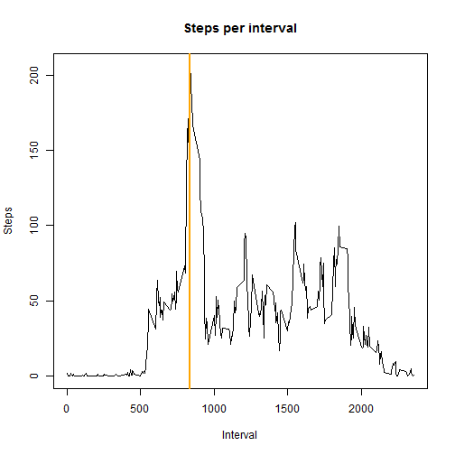
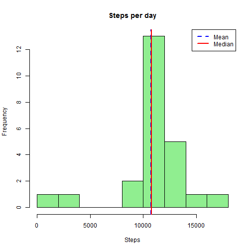

## Reproducible Research Peer Assessment 1


```r
setwd("C:/Users/JWilkinson/represearch/RepData_PeerAssessment1")
df <- read.csv(unz("activity.zip", "activity.csv"))
df$date<- as.Date(df$date, format = "%Y-%d-%m")

df2 <- na.omit(df)
hist(df2$steps, xlab = "Steps", main = "Steps per day", col = "peachpuff")
smean <- mean(df2$steps)
smedian<- median(df2$steps)
abline(v = smean, col = "blue")
abline(v = smedian, col = "red")
legend(x = "topright",c("Mean", "Median"), col = c("blue", "red"), lwd = c(1,1))
```

 

As can be seen in the histogram above the mean steps per day is 37.2568, and the median is 0.


```r
agdf <- aggregate(df, by = list(df$interval), FUN = mean, na.rm = TRUE)
plot(agdf$steps~agdf$interval, type = "l", main = "Steps per interval", xlab = "Interval", ylab = "Steps")
wm <- which.max(agdf[,2])
maxint <- agdf[wm,"interval"]
maxstep <- agdf[wm,"steps"]
abline(v = maxint, col = "orange")
```

 

As noted in the graph above, interval 835 has the highest average steps at 206.1698.


```r
keep <- !is.na(df$date)
df3 <- df[keep,]
missingsteps <- nrow(df3) - nrow(df2)
totmissing <- nrow(df) - nrow(df2)

#due to the uniform nature of the spread of NA values a simple arithmetic mean by interval for NAs replacement was used.

library(data.table)
```

```
## Warning: package 'data.table' was built under R version 3.0.3
```

```r
filldf <- data.table(agdf, key = "interval")
nadf <- data.table(df3, key = "interval")
nadf$steps <- as.numeric(nadf$steps)
outdf <- nadf[filldf]
outdf[is.na(steps), steps:= steps.1]
```

```
##       interval  steps       date Group.1 steps.1     date.1
##    1:        0  1.717 2012-01-10       0   1.717 2012-06-25
##    2:        0  0.000 2012-02-10       0   1.717 2012-06-25
##    3:        0  0.000 2012-03-10       0   1.717 2012-06-25
##    4:        0 47.000 2012-04-10       0   1.717 2012-06-25
##    5:        0  0.000 2012-05-10       0   1.717 2012-06-25
##   ---                                                      
## 6908:     2355  0.000 2012-08-11    2355   1.075 2012-06-25
## 6909:     2355  1.075 2012-09-11    2355   1.075 2012-06-25
## 6910:     2355  1.075 2012-10-11    2355   1.075 2012-06-25
## 6911:     2355  0.000 2012-11-11    2355   1.075 2012-06-25
## 6912:     2355  0.000 2012-12-11    2355   1.075 2012-06-25
```

```r
smean2 <- mean(outdf$steps)
smedian2 <- median(outdf$steps)
hist(outdf$steps, xlab = "Steps", main = "Steps per day", col = "lightgreen")
abline(v = smean2, col = "blue",lwd = 2)
abline(v = smedian2, col = "red", lwd = 2)
legend(x = "topright",c("Mean", "Median"), col = c("blue", "red"), lwd = c(2,2))
```

 

The total rows in our original dataset with NA values is 12384.  The number of rows of data where dates were recorded but there are NA's for steps values is 1728.  It is these rows with dates recorded that will be used going forward with mean for each interval replacing NA values.  The uniform spread of NA's across intervals should minimize the impact of replacement in this manner.  As can be seen in the histogram the new mean is 37.2882 which is nearly the same (less than .3% difference) and the median of 0 is unchanged.


```r
library("plyr")
```

```
## Warning: package 'plyr' was built under R version 3.0.3
```

```r
library("lattice")
```

```
## Warning: package 'lattice' was built under R version 3.0.3
```

```r
outdf$day <- weekdays(outdf$date)
outdf$wkend <- ifelse(outdf$day %in% c("Saturday", "Sunday"),"weekend", "weekday")
avgmeandf <- ddply(outdf, c("interval","wkend"), summarise, mean = mean(steps))
xyplot(mean ~ interval | wkend, avgmeandf, type = "l", layout = c(1,2), ylab = "Average Steps", xlab = "Interval")
```

 

Average steps per day for weekends vs weekdays over 5 minute intervals outlined above.
